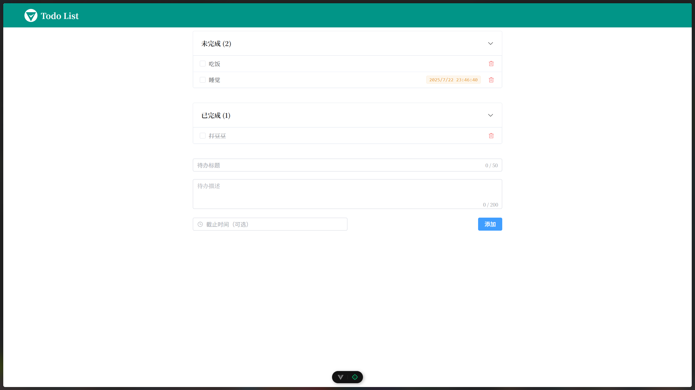
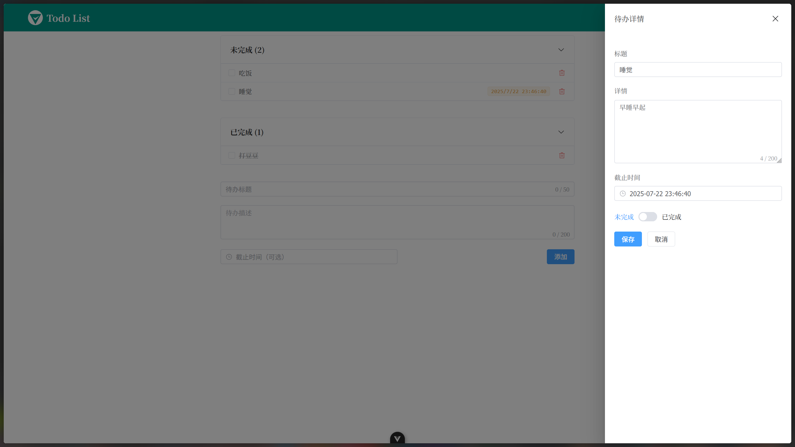

# Todo List

<i>一个示例 Todo List 应用，使用 FastAPI 和 Vue。</i>
<br>

<div align="center">
    
</div>
<br>
<div align="center">
    <a href="https://fastapi.tiangolo.com">
        
    </a>
    <a href="https://vuejs.org">
        
    </a>
</div>

## 一、运行

### 前端

使用 pnpm 管理依赖并运行项目。

```bash
pnpm i && pnpm dev
```

启动后端前先创建 `.env` 文件，并填写配置参数。`VITE_API_BASE_URL` 和 `VITE_API_PREFIX` 为必须的参数。

```
VITE_API_BASE_URL=http://localhost:8080
VITE_API_PREFIX=/api
VITE_API_TIMEOUT=10000
```

### 后端

使用 uv 管理依赖并运行项目。

```bash
uv run run.py
```

启动后端前先创建 `.env` 文件，并填写 `SECRET_KEY` 参数。

```
SECRET_KEY=your_secret_key # 密钥
FRONTEND_URL=http://localhost:5173 # 前端 URL, 用于 CORS
```

## 二、部署

[TODO]

## 三、演示



